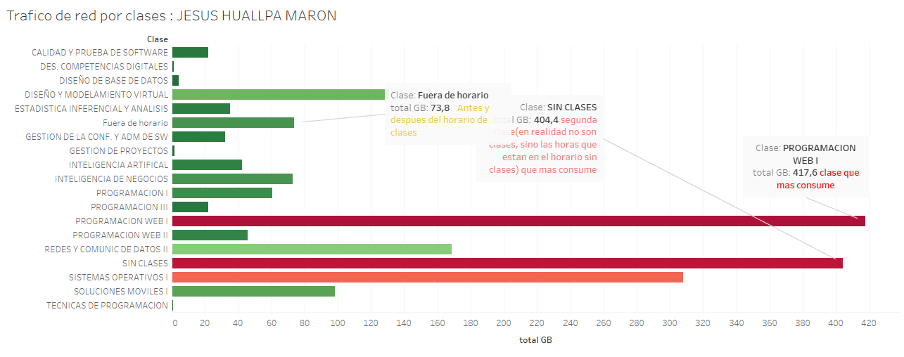

# Proyecto Formatos 01

### Integrantes

| Nombre                             | Insights Totales |
|------------------------------------|-------------------|
| Escobar Rejas, Carlos Andrés  | (2021070016) |
| Apaza Ccalle, Albert Kenyi   | (2021071075) |
| Ricardo Cutipa Gutierrez     | (2021069827) |
| Erick Churacutipa Blass     | (2020067578) |
| Jesus Huallpa Maron          | (2021071085) |

[](https://classroom.github.com/open-in-codespaces?assignment_repo_id=15560310)

# Proyecto: Herramienta de Seguimiento y Evaluación del Desempeño de Red y Hardware en Computadoras UPT

## Dashboard y Reportes

- **Dashboard**:
  
  

- **Reporte 1**:
  
  

- **Reporte 2**:
  
  

- **Reporte 3**:
  
  

- **Reporte 4**:
  
  

- **Reporte 5**:
  
  

## Inventario de Artefactos

| Archivo                      | Descripción                               |
|------------------------------|-------------------------------------------|
| `trafico_red_db.sql`          | Base de datos MySQL que contiene las tablas y registros necesarios para el seguimiento del tráfico de red en los laboratorios.|
| `DesempeñoRed.tbpw`           | Archivo empaquetado de Tableau que contiene los informes y visualizaciones del desempeño de la red. |

## Enlace a Tableau Public

Puedes ver el informe interactivo completo en Tableau Public a través del siguiente enlace: 


[](https://public.tableau.com/app/profile/albert.kenyi.apaza.ccalle/viz/DashboardTraficodeRedUPT/DASHBOARD?publish=yes)


## Contexto del Proyecto

Hablamos con el personal de soporte de los turnos de mañana y tarde. En particular, discutimos con el encargado del turno de la tarde sobre la posibilidad de realizar un análisis detallado del consumo de internet por laboratorio. Se destacó que este análisis permitiría evaluar rápidamente si los problemas en un laboratorio podrían estar relacionados con el alto consumo de internet en otros laboratorios. Además, facilitaría la elaboración de informes sobre el consumo de internet para el laboratorio específico en cuestión.

Se estuvo de acuerdo con esta propuesta, pero se recomendó consultar con el ingeniero encargado para obtener la autorización necesaria para el despliegue del sistema en uno de los laboratorios.

## ¿Cómo se realiza?

* Se utiliza un script de Python 
* Tareas programada de Windows

### Librerías utilizadas en el código

- **psutil**: Para obtener estadísticas de uso de recursos del sistema, como CPU, memoria y red.
- **time**: Para manejar operaciones relacionadas con tiempo, como pausas en la ejecución del script.
- **mysql-connector**: Para interactuar con bases de datos MySQL desde Python, permitiendo la inserción y consulta de datos.
- **socket**: Para obtener información de red, como la IP del equipo.
- **ctypes**: Para realizar llamadas a funciones del sistema operativo Windows.


### Problemas encontrados

- **Uso de Python en lugar de PowerShell (.ps1)**: Inicialmente, se intentó realizar el script en PowerShell, pero no proporcionaba correctamente el consumo de red, por lo que decidimos optar por Python, un intérprete muy conocido y con una amplia comunidad de ayuda en foros.
- **Falta de Python en algunas PCs de los laboratorios**: Algunas PCs no tienen Python instalado, lo que dificultaría la instalación del script.
- **Dependencias adicionales**: Ciertas librerías necesarias (como `psutil` y `mysql-connector`) no vienen instaladas de forma predeterminada con Python.
- **Riesgo de eliminación del script**: Es fácil para los estudiantes eliminar el contenido del script en cualquier ordenador.
- **Mover archivos manualmente**: Trasladar archivos a directorios de forma manual lleva tiempo y puede implicar errores humanos.
- **Fácil daño de archivos XLSX por sobreescritura en tiempo real**: Trabajar con archivos Excel para registrar información de red en tiempo real puede generar errores debido a la constante sobreescritura, dañando los archivos y perdiendo datos importantes.


### Soluciones

- **Archivos BAT para instalación**:
  - `instalar_python.bat`: Buscará el archivo `python-3.12.5-amd64.exe` en el lugar donde se encuentre, sin buscar en otras carpetas, y procederá a su instalación.
  - `instalar_dependencias.bat`: Deberá ejecutarse después de finalizar `instalar_python.bat` para instalar las dependencias necesarias.
  - **Tercer archivo BAT**: Copiará un archivo `.vbs` y el script `.py` en un lugar menos accesible para los estudiantes.
  - **Uso de VBS**: Se utiliza un archivo VBS para que al ejecutarse el script no se muestre una consola o ventana de compilación, evitando que el alumno la cierre e interrumpa el proceso de compilación.

### ¿Cómo funciona?

El script actualiza la base de datos `trafico_red_db` en lugar de crear un archivo `trafico_red.xlsx`. La información se divide en columnas y se almacena en la tabla `trafico_red`, obteniendo los siguientes datos:

- Fecha
- IP
- Clase
- Horario
- Día
- Turno
- Laboratorio
- Total Enviado (MB)
- Total Recibido (MB)
- Tema
- Navegador
- Sección
- Docente
- Total Mbps
- Total GB
- Tiempo de Sesión
- Consumo de Energía (kWh)

Lo más importante es el total recibido y enviado, junto al total general de ambos. 

El script realiza actualizaciones en la base de datos respecto al consumo de la computadora (IP) y ya no envía más reportes por Gmail.

### Estructura de la Base de Datos

```sql
DROP TABLE IF EXISTS `trafico_red`;
CREATE TABLE IF NOT EXISTS `trafico_red` (
  `id` int(11) NOT NULL AUTO_INCREMENT,
  `fecha` date NOT NULL,
  `ip` varchar(255) NOT NULL,
  `clase` varchar(255) NOT NULL,
  `horario` varchar(255) NOT NULL,
  `dia` varchar(255) NOT NULL,
  `turno` varchar(255) NOT NULL,
  `laboratorio` varchar(255) NOT NULL,
  `total_enviado_mb` decimal(10,2) NOT NULL,
  `total_recibido_mb` decimal(10,2) NOT NULL,
  `tema` varchar(255) NOT NULL,
  `navegador` varchar(255) NOT NULL,
  `seccion` varchar(255) NOT NULL,
  `docente` varchar(255) NOT NULL,
  `total_mbps` decimal(20,6) DEFAULT NULL,
  `total_GB` decimal(20,6) DEFAULT NULL,
  `tiempo_sesion` time DEFAULT NULL,
  `consumo_energia_kwh` decimal(20,6) DEFAULT NULL,
  PRIMARY KEY (`id`)
);

### Software

- [](https://www.python.org/)
- [](https://www.tableau.com/)

